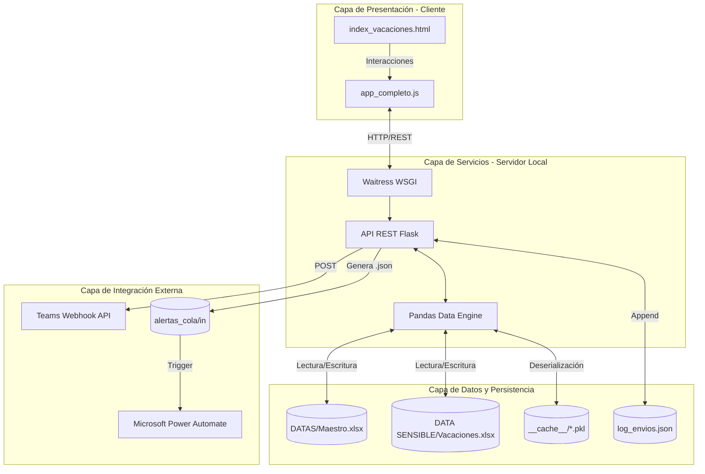
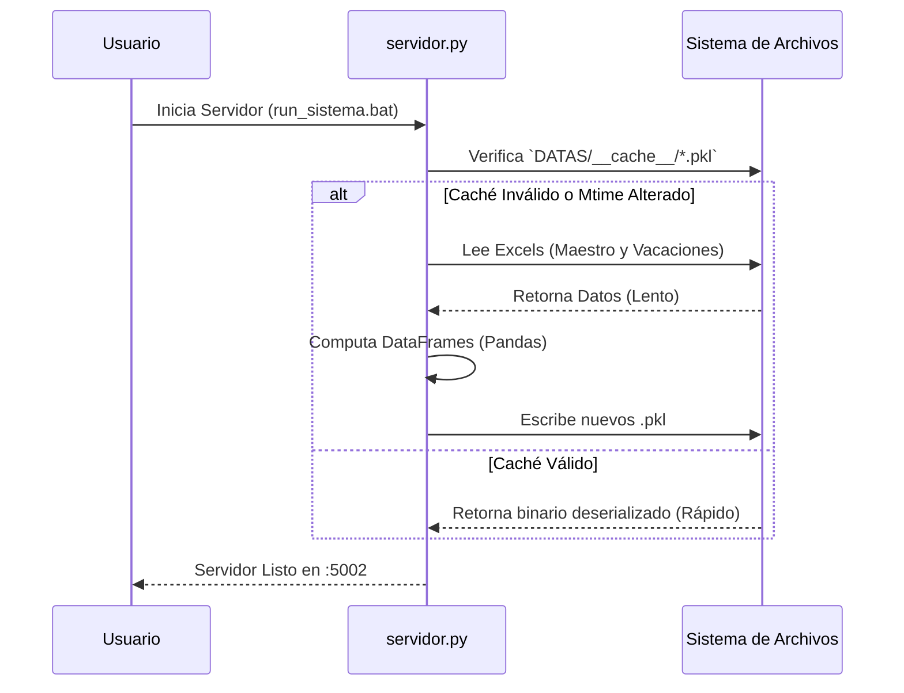
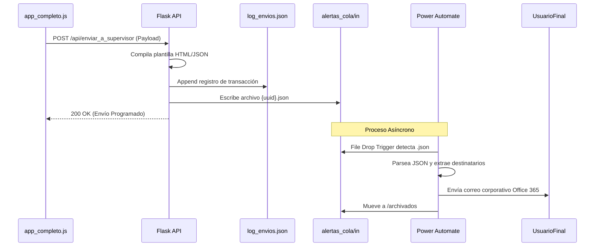

# Arquitectura del Sistema de Vacaciones

Este documento detalla la arquitectura de software del Sistema de Vacaciones, orientada a explicar los componentes, patrones de diseño y flujo de datos de extremo a extremo.

## 1. Visión General de la Arquitectura

El sistema utiliza un patrón arquitectónico monolítico de tipo **Cliente-Servidor (SPA + REST API)**, con persistencia basada enteramente en el sistema de archivos (File-based Persistence) y un mecanismo de mensajería asíncrona mediante un "File Drop" (Cola de archivos) para integraciones externas.

## 2. Descripción de Componentes

### 2.1 Capa de Presentación
La interfaz gráfica es una Single Page Application (SPA). En lugar de usar frameworks como React o Angular, emplea Vanilla JS con manipulación directa del DOM. El estado de la aplicación reside en el cliente durante la sesión.

### 2.2 Capa de Procesamiento (Backend)
Contenida íntegramente en `servidor.py` (~350KB). Realiza tres funciones fundamentales:
1. **Controlador HTTP:** Define las rutas usando los decoradores de Flask.
2. **Motor Analítico:** Utiliza `pandas` para ingerir archivos masivos de Excel, realizar joins (cruce entre Maestro y Vacaciones) y calcular los estados (Elegibles, Con Saldo, etc.).
3. **Dispatcher de Notificaciones:** Compila plantillas HTML y orquesta la salida de mensajes por SMTP nativo, Teams Webhooks y la cola de Power Automate.

### 2.3 Capa de Datos (File-based)
Al no existir un RDBMS (como PostgreSQL o SQL Server), todo el estado reside en el disco:
* **Lectura Pesada:** Archivos `.xlsx`. Para optimizar arranques, el sistema usa `pickle` para serializar en binario los DataFrames resultantes.
* **Transacciones Livianas:** Operaciones ACID-like simuladas mediante archivos `.json` (`confirmaciones_vacaciones.json`) utilizando bloqueos de hilos (`threading.Lock`) para evitar colisiones concurrentes.

## 3. Diagramas de Secuencia

### 3.1 Flujo de Ingesta y Caché

### 3.2 Flujo de Envío de Notificaciones

## 4. Decisiones de Diseño Críticas
1. **Desacoplamiento asíncrono vía "File Drop":** Se optó por escribir `.json` en un directorio de OneDrive (`alertas_cola/in`) en lugar de integrar el Graph API de Microsoft directamente. Esto simplifica enormemente la autenticación, delegando la seguridad de Office 365 a Power Automate.
2. **Caché en Pickle:** Reduce el tiempo de arranque de minutos a segundos, pero requiere limpieza de caché si la versión de Python cambia.
