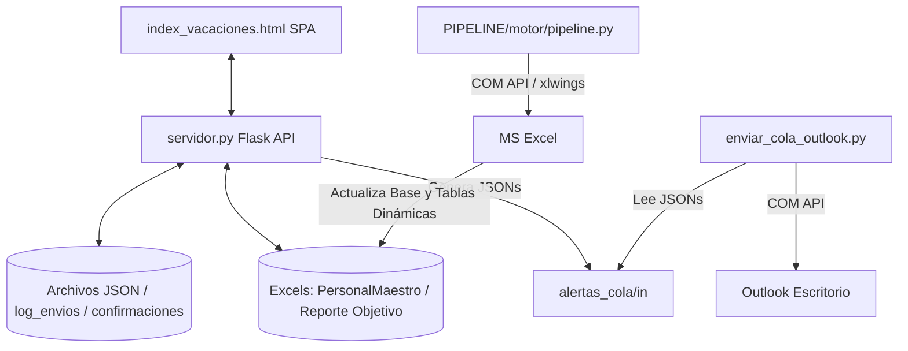

# Guía de Exportación y Análisis Técnico Completo

Este documento describe la arquitectura interna, el flujo de datos, los componentes clave y las configuraciones críticas necesarias para exportar y poner en marcha el **Sistema de Vacaciones USIL** en una nueva máquina.

---

## 1. Arquitectura y Componentes del Sistema

El sistema es una solución híbrida local/escritorio que combina análisis de datos con automatización de envíos:



### A. Backend Monolítico (`servidor.py`)
- **Flask + Waitress**: Servidor web local que se ejecuta en el puerto `5002`.
- **Caché en Disco (`Pickle`)**: En `DATAS/__cache__/*.pkl`. Serializa los DataFrames de Pandas basados en el `mtime` (fecha de modificación) de los Excels para evitar la recarga lenta (de ~15s a <10ms).
- **Concurrencia**: Protege la persistencia ligera (`confirmaciones_vacaciones.json` y `log_envios.json`) mediante `threading.Lock()`.

### B. Frontend SPA (`index_vacaciones.html` + `assets/`)
- Interfaz reactiva escrita en JavaScript Vanilla.
- Lógica de Wizards paso a paso para envíos masivos y controles individuales.

### C. Pipeline de Carga Excel (`PIPELINE/`)
- **Motor en `pipeline.py`**: Utiliza **xlwings** para interactuar con la instancia COM de Microsoft Excel de escritorio. Limpia el crudo descargado de Adryan (`VACRptMotivo_*.xlsx`), actualiza las bases de datos y fuerza un recálculo de fórmulas y refresco de tablas dinámicas.

### D. Envoltorio de Escritorio (`main.js` + Electron)
- Corre el servidor Flask y levanta un navegador de ventana única para la experiencia de app nativa.
- Cuenta con un script de inicio auto-reparable que crea el entorno virtual de Python `.venv` e instala las dependencias si no existen en la máquina objetivo.

---

## 2. Puntos Críticos y Rutas Cableadas (Hardcoded) para la Exportación

Si se traslada o copia esta carpeta a otro computador, **los siguientes elementos fallarán si no se ajustan**:

### 2.1. Rutas de Usuario Específicas
En los archivos de configuración existen rutas absolutas que contienen el nombre de usuario actual (`jlopezp`):

*   **`pa_config.json`**:
    *   `"alertas_cola_dir"`: `"C:\\Users\\jlopezp\\OneDrive - Universidad San Ignacio de Loyola\\alertas_cola"`
    *   *Solución*: Si se deja vacío, el servidor busca automáticamente en la ruta dinámica del OneDrive del usuario activo usando `os.path.expanduser('~')`. Si la estructura de OneDrive cambia, se debe actualizar esta propiedad.
*   **`PIPELINE/motor/config.json`**:
    *   `"carpetas_descarga"`: `["C:/Users/jlopezp/Downloads"]`
    *   `"publicar_en"`: `["C:/Users/jlopezp/OneDrive - Universidad San Ignacio de Loyola/ACTIVIDADES/CESAR/SISTEMA DE VACACIONES/DATA SENSIBLE/Reporte Vacaciones Objetivo_Segundo Trimestre 2026.xlsx"]`
    *   `"python_pipeline"`: `"C:/Users/jlopezp/AppData/Local/Programs/Python/Python313/python.exe"`
    *   *Solución*: Se deben cambiar estas rutas por las correspondientes del nuevo usuario o hacerlas relativas/dinámicas en la nueva instalación.

### 2.2. Rutas Cableadas en Archivos Batch (`.bat`)
*   **`PIPELINE/ACTUALIZAR_VACACIONES.bat`** (Línea 9) y **`PIPELINE/INSTALAR_DEPENDENCIAS.bat`** (Línea 6):
    *   `set "PYEXE=C:\Users\jlopezp\AppData\Local\Programs\Python\Python313\python.exe"`
    *   *Solución*: Cambiar por la ruta local de Python en el nuevo equipo o asegurar que Python esté expuesto en la variable de entorno global `PATH` (el script caerá en `python` si no encuentra el path cableado).

### 2.3. Rutas en Scripts Auxiliares
*   **`_build_analisis.py`**:
    *   `sys.path.insert(0, r"C:\Users\jlopezp\OneDrive...")`
    *   `DATA = Path(r"C:\Users\jlopezp\OneDrive...")`
    *   *Solución*: Modificar el path al exportar para que apunte al directorio actual de ejecución o usar rutas relativas basadas en `Path(__file__)`.

---

## 3. Requisitos del Entorno de Destino

Para que la aplicación funcione en una nueva computadora, esta debe contar con los siguientes prerrequisitos:

1.  **Python 3.10 o Superior**: Debe estar instalado y, de preferencia, añadido al `PATH` del sistema.
2.  **Microsoft Excel (Instalación Local de Escritorio)**: Es indispensable para que el pipeline funcione. Las versiones web u Office 365 en la nube no soportan la interfaz COM de `xlwings`.
3.  **Microsoft Outlook (Instalación Local de Escritorio)**: Requerido por `enviar_cola_outlook.py` (usa la API de integración COM de Outlook para disparar correos desde la cuenta activa de la aplicación sin SMTP).
4.  **Acceso de Escritura a OneDrive / Carpetas de Cola**: Si se usa la integración con Power Automate, la carpeta `alertas_cola` debe estar sincronizada localmente mediante el cliente oficial de OneDrive.

---

## 4. Proceso de Exportación e Instalación en Destino

Siga este procedimiento paso a paso para migrar la aplicación:

### Paso 1: Limpieza antes de exportar
Para reducir el tamaño del paquete y evitar colisiones de versiones de Python:
1.  Eliminar la carpeta `.venv/` (se regenerará en la máquina destino).
2.  Eliminar la carpeta `node_modules/` (se descargará con `npm install`).
3.  Eliminar el contenido de la carpeta de caché `DATAS/__cache__/` (los archivos `.pkl` de Pickle pueden dar fallos de deserialización si la máquina destino tiene otra versión menor de Python o Pandas).
4.  Eliminar la carpeta `dist_electron/` y `dist/`.

### Paso 2: Reconfigurar variables locales
En el equipo de destino:
1.  Abrir `pa_config.json` y actualizar:
    *   `alertas_cola_dir`: Poner la ruta correcta del OneDrive del nuevo usuario.
    *   `smtp_email` / `smtp_password`: Si se usa envío SMTP directo.
    *   `vacaciones_test_email`: Configurar el correo de pruebas.
2.  Abrir `PIPELINE/motor/config.json` y actualizar:
    *   `carpetas_descarga`: Ajustar al directorio de descargas del usuario local.
    *   `publicar_en`: Cambiar a la ruta absoluta local del archivo en `DATA SENSIBLE/`.
    *   `python_pipeline`: Apuntar a la dirección del binario `python.exe` del equipo destino o configurar la variable de entorno para que el sistema use el intérprete por defecto.

### Paso 3: Instalación de Dependencias
1.  Ejecutar `INSTALAR_SISTEMA_VACACIONES.bat` en la raíz. Esto:
    *   Creará el entorno virtual `.venv` local.
    *   Instalará `flask`, `waitress`, `pandas` y `openpyxl`.
    *   Creará el acceso directo en el escritorio.
2.  Navegar a la carpeta `PIPELINE/` y ejecutar `INSTALAR_DEPENDENCIAS.bat` para configurar las librerías del pipeline de Excel (especialmente `xlwings` y `pywin32`).

### Paso 4: Empaquetar y Distribuir (con Auto-Updater)
El sistema ahora utiliza `electron-builder` y `electron-updater` para empaquetar y auto-actualizarse.

1.  Instalar **Node.js** en el equipo de compilación.
2.  En la raíz del proyecto, instalar dependencias:
    ```bash
    npm install
    ```
3.  Para compilar el instalador localmente:
    ```bash
    npm run build
    ```
    Esto creará el empaquetado y el instalador NSIS en `dist_electron/`.

4.  **Para lanzar una nueva actualización del Shell (main.js, package.json):**
    Si modificas `main.js` o configuraciones nativas de Electron, debes generar una nueva versión y publicarla en GitHub Releases:
    ```bash
    npm run release
    ```
    *(Nota: El repositorio debe tener configurados los Releases de GitHub, y requerirá permisos si es un repositorio privado).*

---

## 5. Arquitectura de Auto-Actualización Doble

El sistema cuenta con un mecanismo de auto-actualización de dos niveles:

1. **Auto-Update del Shell (Electron Updater)**:
   * Gestionado por `electron-updater`.
   * Verifica los **GitHub Releases** del repositorio al iniciar la aplicación.
   * Descarga el nuevo instalador NSIS en segundo plano si hay cambios estructurales (ej. modificaciones a `main.js`, `package.json` o actualización de la versión de Electron).
   * Requiere publicar versiones usando `npm run release`.

2. **Auto-Update de Scripts (Motor de Datos)**:
   * Mecanismo ligero que descarga los scripts de Python y archivos frontend directamente desde la rama `main`.
   * Actualiza los archivos lógicos de la app (`servidor.py`, `front`, `pipeline`) sin requerir reinstalación.
   * Se ejecuta de forma silenciosa y transparente para los BPs (Business Partners), garantizando que siempre tengan las últimas reglas de negocio.
